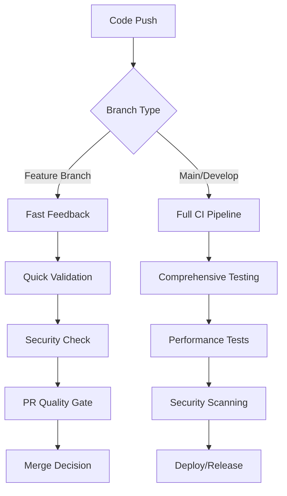

# CI/CD Pipeline Integration Guide

This document describes the comprehensive CI/CD pipeline integration for khive's
testing infrastructure.

## Overview

The CI/CD integration follows a **progressive quality approach** - preventing
regression while enabling development velocity. This addresses the project's
current state (13.56% test coverage) with realistic expectations and practical
quality gates.

## Architecture

### Pipeline Stages



### Workflow Components

1. **Fast Feedback** (`fast-feedback.yml`)
   - Runs on feature branches
   - <5 minute execution
   - Basic syntax, imports, smoke tests

2. **Quality Gates** (`quality-gate.yml`)
   - PR validation
   - Progressive coverage baseline (13%)
   - Security checks
   - Merge approval/rejection

3. **Comprehensive Testing** (`test-advanced.yml`)
   - Full test matrix
   - Cross-platform validation
   - Performance benchmarking

4. **Test Reporting** (`test-report.yml`)
   - Weekly status reports
   - Coverage trend analysis
   - Recommendations

## Configuration

### Progressive Quality Gates

```yaml
# Coverage baseline - realistic for current state
coverage_baseline: 13.0%
coverage_target: 20.0%

# Test count minimums
min_test_functions: 10
min_test_files: 5

# Security checks
- No hardcoded secrets
- No dangerous eval/exec usage
- Import structure validation
```

### Execution Matrix

| Trigger             | Fast Feedback | Quality Gate | Comprehensive | Performance |
| ------------------- | ------------- | ------------ | ------------- | ----------- |
| Feature Branch Push | ✅            | ❌           | ❌            | ❌          |
| PR to Main          | ✅            | ✅           | ❌            | ❌          |
| Main Branch Push    | ❌            | ❌           | ✅            | ✅          |
| Weekly Schedule     | ❌            | ❌           | ✅            | ✅          |

## Quality Gate Enforcement

### Passing Criteria

1. **Unit Tests**: All unit tests must pass
2. **Coverage**: Must not regress below 13% baseline
3. **Code Quality**: No critical lint errors (E9, F63, F7, F82)
4. **Security**: No obvious vulnerabilities detected
5. **Import Structure**: Core imports must work

### Failure Handling

- **Soft Failures**: Generate warnings but allow merge
  - Low test count (< 10 functions)
  - Performance degradation
  - Non-critical lint issues

- **Hard Failures**: Block merge
  - Test failures
  - Coverage regression
  - Security vulnerabilities
  - Critical lint errors

## Caching Strategy

### Dependency Caching

```yaml
- name: Cache dependencies
  uses: actions/cache@v4
  with:
    path: ~/.cache/uv
    key: uv-${{ runner.os }}-${{ hashFiles('pyproject.toml', 'uv.lock') }}
```

### Test Result Caching

- Coverage data cached between runs
- Baseline performance metrics stored
- Security scan results cached (24h)

## Security Integration

### Automated Security Checks

1. **Static Analysis**
   - Hardcoded credentials detection
   - Dangerous function usage (eval, exec)
   - Import security validation

2. **Dynamic Testing**
   - Security test suite execution
   - Input validation testing
   - File security checks

3. **Dependency Scanning**
   - Bandit security linting
   - Known vulnerability detection

## Performance Monitoring

### Benchmarking Strategy

1. **Quick Performance Tests**
   - Run on every PR
   - Basic timing checks
   - Import speed validation

2. **Comprehensive Benchmarks**
   - Weekly execution
   - Full performance suite
   - Regression detection

3. **Baseline Management**
   - Performance baselines stored in git
   - Automated baseline updates on main
   - Regression threshold: 20%

## Reporting & Notifications

### Test Reports

1. **PR Comments**
   - Coverage summary
   - Quality gate status
   - Next steps guidance

2. **Weekly Reports**
   - Comprehensive test status
   - Coverage trends
   - Recommendations

3. **Artifact Storage**
   - Coverage reports (HTML/XML)
   - Performance data (JSON)
   - Security scan results

## Development Workflow Integration

### For Developers

1. **Feature Development**
   ```bash
   # Create feature branch
   git checkout -b feature/my-feature

   # Make changes
   # Push triggers fast feedback
   git push origin feature/my-feature

   # Create PR triggers quality gate
   ```

2. **Quality Gate Response**
   - **Pass**: PR approved for merge
   - **Fail**: Fix issues and re-push

### For Maintainers

1. **Merge to Main**
   - Triggers comprehensive testing
   - Updates performance baselines
   - Generates status reports

2. **Weekly Review**
   - Review test infrastructure status
   - Plan coverage improvements
   - Address security findings

## Configuration Files

### Test Configuration (`pyproject.toml`)

```toml
[tool.pytest.ini_options]
# Progressive approach - no coverage by default for dev speed
addopts = ["--no-cov", "--disable-warnings"]

# CI/CD overrides coverage enforcement
# Use: --override-ini="addopts=" --cov=src/khive
```

### Coverage Configuration

```toml
[tool.coverage.run]
source = ["src/khive"]
branch = true
parallel = true

[tool.coverage.report]
# Progressive baseline
fail_under = 13.0
show_missing = true
```

## Troubleshooting

### Common Issues

1. **Coverage Regression**
   ```bash
   # Check current coverage
   uv run pytest --cov=src/khive --cov-report=term

   # Identify missing coverage
   uv run coverage report --show-missing
   ```

2. **Security Gate Failures**
   ```bash
   # Run security checks locally
   grep -r "password.*=" src/ --include="*.py"
   grep -r "eval(" src/ --include="*.py"
   ```

3. **Performance Degradation**
   ```bash
   # Run performance tests locally  
   uv run pytest tests/performance/ --benchmark-only
   ```

### Local Development

```bash
# Run quality gate locally
./scripts/quality-gate-local.sh

# Run fast feedback checks
./scripts/fast-feedback-local.sh

# Generate test report
./scripts/generate-test-report.sh
```

## Future Enhancements

### Planned Improvements

1. **Adaptive Baselines**
   - Coverage baseline increases with project maturity
   - Performance targets adjust based on usage patterns

2. **Advanced Security**
   - SAST/DAST integration
   - Dependency vulnerability scanning
   - Container security scanning

3. **Enhanced Reporting**
   - Dashboard integration
   - Slack/email notifications
   - Trend analysis and predictions

4. **Test Automation**
   - Auto-generated test suggestions
   - Coverage gap identification
   - Flaky test detection

## Best Practices

### For Team Adoption

1. **Start Simple**: Use progressive approach, don't enforce perfect coverage
   immediately
2. **Fast Feedback**: Prioritize quick validation over comprehensive testing on
   feature branches
3. **Realistic Goals**: Set achievable baselines that prevent regression
4. **Regular Review**: Weekly review of test infrastructure status
5. **Security First**: Never compromise on basic security validation

### Maintenance

1. **Baseline Updates**: Review and adjust baselines quarterly
2. **Performance Tuning**: Optimize CI/CD execution time regularly
3. **Security Updates**: Keep security scanning tools updated
4. **Documentation**: Keep this guide updated with changes

---

_This integration balances comprehensive testing with development velocity,
providing a foundation for scaling test coverage as the project matures._
