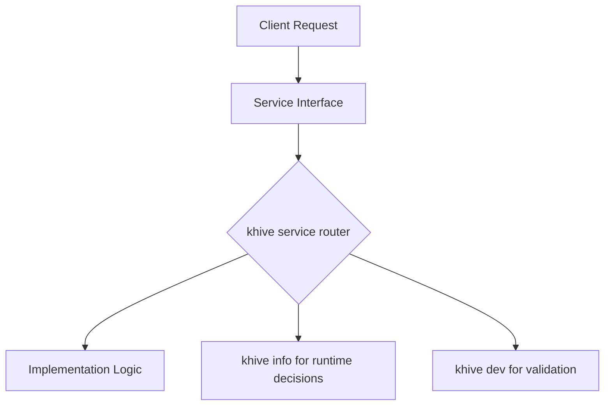
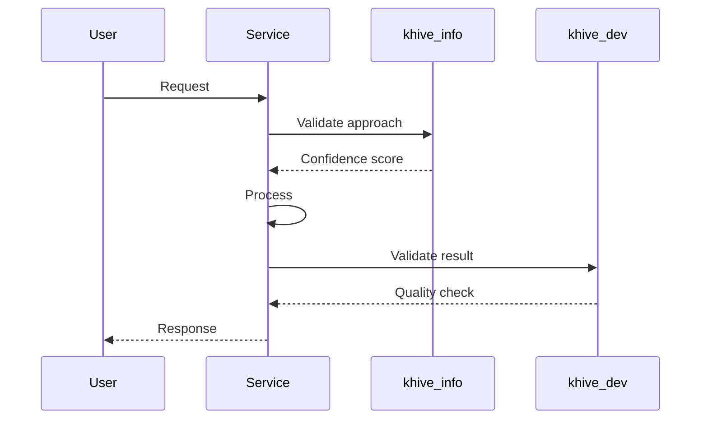

# Guidance

**Purpose**\
Create implementation-ready designs that leverage khive services.

**Service Integration**

- Use `khive info` to validate all design decisions
- Design for service-based implementation
- Focus on interfaces, not implementation details

**Best Practices**

- Let services handle complexity in implementation
- Specify what, not how
- Include service validation for key decisions

---

# Technical Design Specification: [Component Name]

## 1. Overview

### 1.1 Purpose

_Component purpose in context of service architecture_

### 1.2 Service Integration Points

- Which khive services will this component use?
- How will it be tested with `khive dev`?
- How will it be deployed with `khive git`?

### 1.3 Design Validation

```bash
# Key design decisions validated with:
khive info "Best practices for [specific pattern]"
# Service confidence: X%
```

## 2. Architecture

### 2.1 Service-Oriented Design



### 2.2 Interface Design

```python
class AuthenticationService:
    """
    Service interface designed for natural language usage.
    Implementation will leverage khive services.
    """
    
    async def authenticate(self, credentials: str) -> AuthResult:
        """
        Implementer note: Use khive services for:
        - Validation (khive dev)
        - Logging (automatic with services)
        - Error handling (service-provided)
        """
        pass
```

## 3. Data Models

### 3.1 Service-Friendly Models

```python
class TokenRequest(BaseModel):
    """Designed to work with khive info insights"""
    
    # Field validated by khive info research
    storage_method: Literal["file", "keyring"] = "file"
    
    # Service-recommended defaults
    refresh_interval: int = 3600  # khive info: "Industry standard"
    
    class Config:
        # Enable service integration
        schema_extra = {
            "khive_service": "auth",
            "validation_mode": "strict"
        }
```

## 4. Behavior Specifications

### 4.1 Service-Driven Workflows



### 4.2 Error Handling Strategy

- Let khive services handle standard errors
- Only specify domain-specific error cases
- Services provide automatic retry and logging

## 5. Implementation Guidance

### 5.1 For Implementer

1. Start with: `khive git "implement [component] for issue X"`
2. Use `khive dev` for continuous validation
3. Let `khive git` handle commits and PRs
4. Focus on business logic, not infrastructure

### 5.2 Service Capabilities

The implementation can rely on:

- Automatic formatting (khive dev)
- Smart commits (khive git)
- Continuous validation (khive dev)
- Integrated testing (khive ci via dev)

## 6. Validation Strategy

### 6.1 Design Validation

All key decisions validated with:

```bash
khive info "[specific decision rationale]"
# Confidence: X%
# Alternative considered: Y
```

### 6.2 Implementation Validation

Implementer will use:

- `khive dev --check` for continuous validation
- `khive dev --diagnostic` for deep analysis
- Service-provided test coverage metrics

## 7. Risks and Mitigations

### 7.1 Service-Identified Risks

| Risk              | Source              | Mitigation    | Validation                    |
| ----------------- | ------------------- | ------------- | ----------------------------- |
| Token corruption  | khive info research | Atomic writes | khive dev will test           |
| Concurrent access | khive info analysis | File locking  | Service handles automatically |

## 8. Open Questions

_For khive info to research:_

- Question 1
- Question 2

_For implementation validation:_

- Will be tested with khive dev
